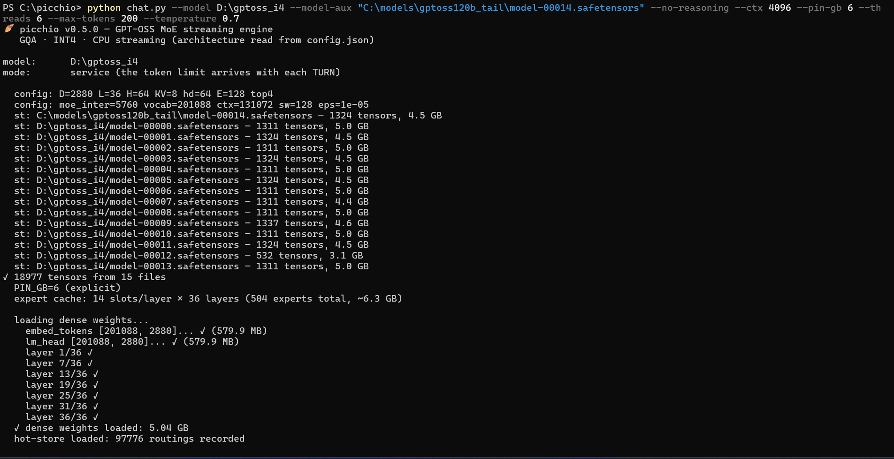
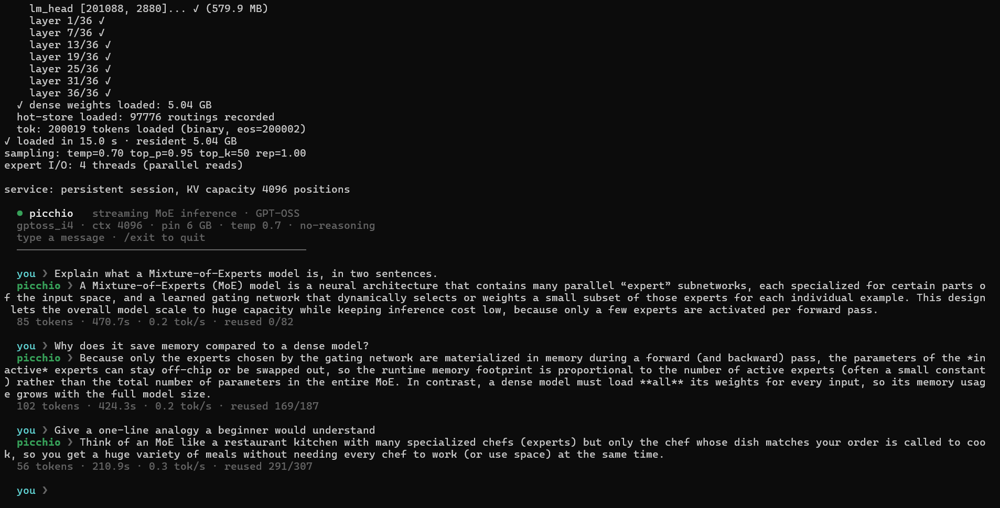

<p align="center">
  
</p>

> *The woodpecker drums a hundred times a second on a huge trunk;
> we drum 128 experts on a huge disk.*

**A streaming Mixture-of-Experts (MoE) inference engine for the GPT-OSS models
(20B and 120B), written in pure C, that runs models larger than your RAM on
ordinary consumer hardware.**

Most of a MoE model's weight is in its *experts*, and only a handful of experts
are used for each token. Picchio keeps only the small "dense" part of the model
permanently in memory and **streams the experts from disk on demand**, caching
the ones it has recently used. This is what lets a 14 GB model (20B) run
comfortably on a 16 GB laptop, and makes the 66 GB model (120B) runnable at all
without a datacenter GPU.

Inspired by [Colibri](https://github.com/JustVugg/colibri) (GLM), adapted for the
GPT-OSS architecture.

### Supported models

The same streaming core serves two MoE families. The engine reads every dimension
from `config.json` and flips the family-specific behaviors from the model's
`model_type`, so adding the second family left the GPT-OSS path byte-for-byte
unchanged.

| Family | Models | Converted size | Chat bridge |
|---|---|---|---|
| **GPT-OSS** | `gpt-oss-20b`, `gpt-oss-120b` | ~14 GB / ~66 GB | [`chat.py`](chat.py) (Harmony) |
| **Qwen3-MoE** | e.g. `Qwen3-30B-A3B` | ~20 GB | [`chat_qwen.py`](chat_qwen.py) (ChatML) |

The Qwen3 support is config-gated: QK-Norm, plain SwiGLU, softmax-normalized
top-k routing, and full attention (no sinks, no sliding window) are switched on
only for Qwen checkpoints. See [Running a Qwen3-MoE model](#12-running-a-qwen3-moe-model)
and [`PORTING_QWEN3.md`](PORTING_QWEN3.md).

**It can also split a model across two machines on a LAN** and run them as one, so
a model too big for any single computer can run by pooling their RAM. Only the
small residual-stream vector crosses the network, and the output is byte-identical
to a single node. See [Distributed inference across two machines](#13-distributed-inference-across-two-machines).

> **New to this?** Read the sections in order. Every command below is complete:
> nothing is assumed. Windows commands are shown for **PowerShell**; Linux/macOS
> equivalents are given where they differ.

---

## Table of contents

1. [What you need (hardware & software)](#1-what-you-need)
2. [Install the toolchain](#2-install-the-toolchain)
3. [Build the engine](#3-build-the-engine)
4. [Download and convert a model](#4-download-and-convert-a-model)
5. [Run it: the chat bridge (recommended)](#5-run-it-the-chat-bridge-recommended)
6. [Run it: an OpenAI-compatible API server](#6-run-it-an-openai-compatible-api-server)
7. [Running the big model (120B)](#7-running-the-big-model-120b)
8. [Tuning & environment variables](#8-tuning--environment-variables)
9. [Troubleshooting](#9-troubleshooting)
10. [Verifying correctness (optional)](#10-verifying-correctness-optional)
11. [How it works & project layout](#11-how-it-works--project-layout)
12. [Running a Qwen3-MoE model](#12-running-a-qwen3-moe-model)
13. [Distributed inference across two machines](#13-distributed-inference-across-two-machines)
14. [License](#14-license)

---

## 1. What you need

### Hardware

| Resource | Minimum | Recommended (20B) | Notes |
|---|---|---|---|
| **CPU** | x86-64 **with AVX2** | 6+ cores with AVX2/FMA | Almost every desktop/laptop CPU since ~2013 has AVX2. Without it the build fails or runs very slowly. |
| **RAM** | 8 GB | 16 GB | The 20B needs ~3 GB always resident + expert cache. More RAM = more cache = less disk reading = faster. |
| **Disk** | ~30 GB free | SSD/NVMe, ~30 GB free | The model is read from disk **constantly**, so an internal SSD matters a lot. A USB drive roughly doubles the I/O time. |

The 120B model additionally needs ~70 GB of free disk and benefits from as much
RAM as you can give it (see [section 7](#7-running-the-big-model-120b)).

### Software

- A **C compiler** (GCC or Clang). On Windows this means MSYS2/MinGW.
- **Python 3.9+** (for converting the model and for the chat/server bridges).
- An internet connection to download the model once from Hugging Face.

---

## 2. Install the toolchain

### Windows

**a) Install MSYS2 (provides the GCC compiler).**

1. Download and run the installer from <https://www.msys2.org>.
2. Accept the default install location `C:\msys64`.
3. Open the **"MSYS2 MinGW 64-bit"** terminal from the Start menu and install GCC:
   ```bash
   pacman -S mingw-w64-x86_64-gcc make
   ```
4. `build.bat` expects the compiler at `C:\msys64\mingw64\bin\gcc.exe` (the
   default). If you installed elsewhere, edit the `GCC=` line in `build.bat`.

**b) Install Python** from <https://www.python.org/downloads/> (tick
"Add Python to PATH" during setup).

### Linux

```bash
sudo apt install build-essential python3 python3-pip   # Debian/Ubuntu
```

### macOS

```bash
xcode-select --install          # gives you clang + make
brew install python             # if you don't already have Python 3
```

---

## 3. Build the engine

From the project folder (`C:\picchio` or wherever you cloned it):

### Prebuilt binary (no compiler needed)

If you would rather not build from source, download the prebuilt Windows binary
from the [Releases page](https://github.com/benmaster82/picchio/releases/latest):

- Save it as **`picchio.exe`**. If the asset has a versioned name (e.g.
  `picchio-v0.5.0-win64-avx2.exe`), rename it to `picchio.exe`, or pass
  `--exe <name>` to `chat.py` / `server.py`. Every command below assumes the file
  is called `picchio.exe`.
- It is a **static build**: no MinGW DLLs, runs from anywhere.
- Requires **Windows x64 with an AVX2/FMA CPU** (2013 or newer). The binary is
  unsigned, so Windows SmartScreen may warn on first run ("More info" then "Run
  anyway").
- Verify the download against the **SHA256** published on the release.

Then skip to [section 4](#4-download-and-convert-a-model) to get a model. To
compile it yourself instead (any OS), continue below.

### Windows

```powershell
.\build.bat
```

This produces a **self-contained `picchio.exe`** (statically linked, it does not
need any MinGW DLLs and runs from anywhere).

Or compile by hand from the MSYS2 MinGW terminal:
```bash
gcc -O2 -Wall -fopenmp -mavx2 -mfma -Wno-misleading-indentation \
    -Wno-unused-function -static -Wl,--stack,8388608 \
    -o picchio.exe picchio.c -lm -lpsapi
```

### Linux / macOS

```bash
make
```

### Why these flags (don't skip them)

- `-fopenmp`: enables multi-core. **Without it, all matmuls run on one core** and
  everything is several times slower.
- `-mavx2 -mfma`: enables the SIMD kernels. Without them the math falls back to
  slow scalar code. Your CPU must support AVX2.
- `-static` (Windows): bakes the OpenMP/pthread runtime into the exe so you don't
  need `libgomp-1.dll` / `libwinpthread-1.dll` next to it.

### Verify the build

```powershell
.\picchio.exe --self-test        # Windows
./picchio --self-test            # Linux/macOS
```

This runs the full forward pass on a tiny synthetic model, **no model download
needed**. You should see `── self-test PASSED ──`. If you
do, the engine works.

---

## 4. Download and convert a model

GPT-OSS ships in a format Picchio can't read directly (MXFP4). You convert it
**once** into Picchio's INT4 format. We'll use the **20B model**, which is the
recommended choice for 16 GB machines.

### a) Install the conversion dependencies

```powershell
pip install torch safetensors numpy huggingface_hub
```

### b) Download + convert in one step

```powershell
python convert.py --model openai/gpt-oss-20b --output C:\models\gptoss20b_i4 --download
```

- `--model`: the Hugging Face repo id (`openai/gpt-oss-20b`).
- `--output`: a folder **you choose** where the converted model will be written.
  Put it on your fastest internal disk. Use any path you like (e.g.
  `C:\models\gptoss20b_i4` or `~/gptoss20b_i4`).
- `--download`: fetch the model from Hugging Face automatically. Omit this if you
  already downloaded the raw model yourself and pointed `--model` at a local
  folder.

This downloads several GB and writes a converted model of about **14 GB** to the
output folder. It only needs to be done once.

> **Reclaim space after converting.** The raw Hugging Face download is left in a
> sibling folder named `<output>_raw` (e.g. `C:\models\gptoss20b_i4_raw`). Only the
> `--output` folder is needed to run Picchio, so once the conversion finishes you
> can delete `<output>_raw` to free that extra space.

> **Hugging Face access:** the GPT-OSS models are openly licensed and normally
> download without an account. If you ever get a `401`/gated error, run
> `pip install huggingface_hub` and `huggingface-cli login` once with a free
> token from <https://huggingface.co/settings/tokens>.

### c) Build the tokenizer file

Picchio needs a small binary tokenizer file next to the model:

```powershell
python export_vocab.py C:\models\gptoss20b_i4\tokenizer.json C:\models\gptoss20b_i4\picchio_vocab.bin
```

(The two arguments are: the `tokenizer.json` that came with the model, and the
output path for the binary vocab. `export_vocab.py` has no dependencies.)

Your model folder is now ready to use.

---

## 5. Run it: the chat bridge (recommended)

`chat.py` is the **recommended way to talk to the model**. It uses OpenAI's
official "Harmony" library to format the conversation exactly the way GPT-OSS
expects, so the output is correct token-for-token.

### a) Install the chat dependency

```powershell
pip install -r requirements-chat.txt
```

(That installs `openai-harmony`, the only extra package needed to chat.)

### b) Ask a single question

```powershell
python chat.py "Write a short greeting in English." --model C:\models\gptoss20b_i4 --pin-gb 4 --ctx 1024
```

- **`--model`**: the folder you converted in step 4. **You must pass this**
  (the built-in default points at a 120B path and won't match your setup).
- **`--pin-gb`**: how many GB of RAM to spend on the expert cache. More = faster
  (fewer disk reads). `4` is a good start on a 16 GB machine.
- **`--ctx`**: context window in tokens (how much conversation history fits).
  `1024` is fine to start.

### c) Interactive multi-turn chat

Omit the prompt to get a chat loop that keeps the model and its cache in memory
between turns:

```powershell
python chat.py --model C:\models\gptoss20b_i4 --pin-gb 4 --ctx 1024 --max-tokens 200 --temperature 0.7
```

Type your message after the `you ❯` prompt. Type `/exit` or `/quit` to leave.

### Useful chat options

| Option | What it does |
|---|---|
| `--temperature 0.7` | Randomness. **Use ~0.7 for normal conversation.** The default `0` (greedy) is deterministic but can make the model loop in its "thinking" channel without answering. |
| `--max-tokens 200` | Maximum length of the reply. |
| `--no-reasoning` | Skip the internal "analysis" (chain-of-thought) and answer directly. Faster, but **can degrade multi-turn chats on large models** (see Troubleshooting) — prefer `--reasoning low` if answers deteriorate after a few turns. |
| `--show-analysis` | Deprecated: the reasoning is now always streamed live (dimmed, under a `thinking ❯` header) next to the answer. |
| `--top-p`, `--top-k`, `--seed` | Standard sampling controls. |
| `--reasoning low\|medium\|high` | How much the model thinks before answering. |
| `--json` | Print the structured reply as JSON. |
| `--dry-run` | Show the exact tokens that would be sent, without loading the model (handy for debugging). |

### The bare-metal path (advanced / quick test)

You can run the engine directly without Python. This uses a **built-in
approximate tokenizer** (not token-exact; prefer `chat.py` for real use):

```powershell
$env:MODEL = "C:\models\gptoss20b_i4"
$env:INPUT = "The capital of Italy is"
$env:MAX   = "40"
.\picchio.exe
```

On Linux/macOS:
```bash
MODEL=~/gptoss20b_i4 INPUT="The capital of Italy is" MAX=40 ./picchio
```

---

## 6. Run it: an OpenAI-compatible API server

`server.py` exposes the model over HTTP with the same API shape as OpenAI, so any
OpenAI-compatible client or tool can talk to it. It uses only the Python standard
library plus `openai-harmony` (already installed in step 5a).

### Start the server

```powershell
python server.py --model C:\models\gptoss20b_i4 --port 8000 --pin-gb 4 --ctx 1024
```

It prints `[server in ascolto su http://127.0.0.1:8000 ...]` when ready.

### Endpoints

- `POST /v1/chat/completions`: streaming (SSE) and non-streaming.
- `GET  /v1/models`
- `GET  /health`

### Use it from the official OpenAI Python client

```python
from openai import OpenAI
client = OpenAI(base_url="http://127.0.0.1:8000/v1", api_key="not-needed")

resp = client.chat.completions.create(
    model="gptoss20b",
    messages=[{"role": "user", "content": "Say hello in one sentence."}],
    max_tokens=64,
    temperature=0.7,
)
print(resp.choices[0].message.content)
```

### Use it with `curl`

```bash
curl http://127.0.0.1:8000/v1/chat/completions \
  -H "Content-Type: application/json" \
  -d '{"model":"gptoss20b","messages":[{"role":"user","content":"Hello"}],"max_tokens":64}'
```

**Per-request options** (in the JSON body): `temperature`, `top_p`, `top_k`,
`max_tokens`, `reasoning_effort` (`"low"`/`"medium"`/`"high"`), and
`no_reasoning: true`.

**Note:** the model is a single process with one KV-cache, so requests are handled
**one at a time** (serialized). This is meant for personal/local use, not for
serving many users concurrently.

---

## 7. Running the big model (120B)

The 120B converts to about 66 GB and runs on the same machine as the 20B, only
much more slowly, because far more must be streamed from disk. It is a "works,
with patience" model, not a daily driver: expect well under 1 token/s (see
[Measured performance](#measured-performance-a-deliberate-worst-case) below for
real numbers on consumer hardware). For everyday use the 20B is the better choice.

### Before you start

- **Disk space:** you need about **70 GB free** on the output drive.
  On Windows, "used space" can be inflated by hidden shadow copies (System
  Restore) under `System Volume Information`: if a drive looks full but your files
  don't add up, reclaim it with Disk Cleanup, or from an **Administrator** prompt:
  `vssadmin delete shadows /for=D: /all`.
- **Dependencies** (same as section 4, plus the fast downloader):
  ```powershell
  pip install torch safetensors numpy huggingface_hub hf_transfer
  ```

### Download + convert, shard by shard

`convert_streaming.py` downloads and converts **one shard at a time**, never
keeping more than one raw shard (~4.6 GB) on disk. `hf_transfer` makes the
download several times faster (multi-connection: ~5 MB/s vs ~0.7 MB/s in testing):

```powershell
$env:PYTHONUTF8 = "1"                  # progress symbols print correctly
$env:HF_HUB_ENABLE_HF_TRANSFER = "1"   # multi-connection downloads (much faster)
$env:PICCHIO_OUTPUT = "D:\gptoss120b_i4"   # where the converted shards go (~66 GB)
$env:PICCHIO_RAW    = "D:\gptoss_tmp"       # scratch for the single raw shard
python convert_streaming.py
```

- `PICCHIO_OUTPUT`, `PICCHIO_RAW`, and `PICCHIO_REPO` are read from the
  environment; point them at a disk with room (defaults are set in the script).
- **Resumable:** already-converted shards are skipped, so if the download drops
  or you stop it, just run the same command again and it continues.
- **Do not use an HF mirror here.** `HF_ENDPOINT=hf-mirror.com` serves the small
  config files but **fails on the large LFS shards**. Download from Hugging Face
  directly (the default).

When it finishes, the output folder holds `model-00000.safetensors` through
`model-00014.safetensors`, plus `config.json`, `tokenizer.json`, and
`picchio_vocab.bin` (the vocab is generated for you). The expert biases are
baked into the shards (F32), so **no separate sidecar is needed**.

### Run it

Keep the context and cache modest on 16 GB (the dense part alone is ~5 GB):

```powershell
$env:PYTHONUTF8 = "1"
python chat.py --model D:\gptoss120b_i4 --no-reasoning --ctx 1024 --pin-gb 6 --max-tokens 200 --temperature 0.7
```

On startup Picchio reads the architecture from `config.json`, opens all 15
shards, and loads only the ~5 GB dense part into RAM; the experts stay on disk
and are streamed on demand:



The first turn is slow (it streams every expert from disk); later turns reuse the
KV prefix and the learned hot-store, so they speed up. You can see this in a real
three-turn session: the `reused` counter on each stats line climbs from `0/82` to
`169/187` to `291/307` as the KV-cache prefix is carried over between turns.



### Measured performance (a deliberate worst case)

The numbers below are a **deliberate stress test**: the whole point of Picchio is
to prove a 117B-parameter MoE model can run *at all* on a consumer laptop with
limited RAM, streaming the experts from an **external SSD**. This is the hardest
case on purpose, not a representative one. On an internal NVMe drive, or with more
RAM devoted to the expert cache (`--pin-gb`), the rates are higher.

Test configuration:

| | |
|---|---|
| Model | GPT-OSS-120B, INT4 (gs64) experts, F32 attention (~66 GB) |
| Storage | external SSD (shards split across two drives via `--model-aux`) |
| Launch | `--no-reasoning --ctx 4096 --pin-gb 6 --threads 6 --temperature 0` |
| Expert cache | 6 GB pinned (`--pin-gb 6`), 4 parallel I/O threads |

Three-turn chat, generating 16 tokens per turn:

| Turn | KV reused | Prefill | Time-to-first-token | Decode rate | Overall rate |
|-----:|----------:|--------:|--------------------:|------------:|-------------:|
| 1 (cold) | 0 / 86 | 86 tok | 218 s | 0.22 tok/s | **0.038 tok/s** |
| 2 (warm) | 95 / 110 | 15 tok | 37 s | 0.24 tok/s | **0.16 tok/s** |
| 3 (warm) | 126 / 147 | 21 tok | 54 s | 0.29 tok/s | **0.15 tok/s** |

Two things to read from this:

- **Steady-state decode is stable at ~0.25 tok/s** and is the real hardware
  ceiling: every token routes to 4 of 128 experts per layer, streamed from the
  SSD. This barely changes turn to turn.
- **Perceived (overall) speed depends almost entirely on the prefill.** The first
  turn must process the entire prompt from scratch (86 tokens, 218 s before the
  first token), so its overall rate collapses to ~0.04 tok/s. From the second turn
  on, Picchio reuses the KV-cache prefix (95/110, 126/147 positions reused), so
  only the small delta is re-processed and the overall rate jumps about **4x, to
  ~0.15 tok/s**. Short, continuous turns stay close to the decode ceiling; long new
  prompts pay the prefill cost up front.

In short: on this hardware the 120B is usable for careful, patient exchanges, not
interactive chat. If you want responsiveness, run the 20B.

### If it doesn't fit on one drive

You can spread the shards across two disks and pass the ones on the second disk
with `--model-aux` (semicolon-separated). For example, if the last shard lives on C::

```powershell
python chat.py --model D:\gptoss120b_i4 --model-aux "C:\gptoss120b_extra\model-00014.safetensors" --no-reasoning --ctx 1024 --pin-gb 6
```

`--model-aux` also carries any other loose files a model may need.

> **Legacy note (bias sidecar).** Containers converted with older code quantized
> the expert biases by mistake and needed a separate F32 sidecar
> (`python download_expert_biases.py` writes `expert_biases.safetensors`, passed
> via `--model-aux`). A fresh conversion with the current `convert.py` includes
> the biases in the shards, so you can ignore this.

---

## 8. Tuning & environment variables

Picchio is configured through environment variables (the `chat.py`/`server.py`
flags map onto these). The most useful:

| Variable | Default | Meaning |
|---|---|---|
| `MODEL` | (none) | Path to the converted model folder (or pass it as the first argument). |
| `PIN_GB` | **auto** | GB of RAM for the expert cache. **The single biggest performance knob.** By default it's sized automatically from your physical RAM (all RAM minus a ~6 GB reserve). A bigger cache means fewer disk reads. Setting a value overrides the auto-sizing. |
| `CTX` | 512 | KV-cache size in tokens (max prompt+generation length). |
| `OMP_NUM_THREADS` | all cores | Number of CPU threads for the matmuls. |
| `MAX` | 128 | Max tokens to generate (bare-metal run only). |
| `TEMPERATURE` | 1.0 | Sampling temperature (`0` = greedy). |
| `TOPP` / `TOPK` | 0.95 / 50 | Nucleus / top-k sampling. |
| `SEED` | fixed | RNG seed for reproducible sampling. |
| `IO_THREADS` | 4 | Threads used for reading experts from disk in parallel. |
| `MODEL_AUX` | (none) | Extra model files on other disks (semicolon-separated). |
| `IDOT` | `0` | `1` = integer expert kernel (int8 activation × int4 weight). Uses AVX-VNNI (`dpbusd`) where the CPU supports it, else AVX2; a small approximation, so off by default. |
| `DROP` | `0` | `1` = drop just-read pages from the OS page cache after each read (Linux), keeping peak RAM at "dense + cache" when streaming a model larger than RAM. |
| `DIRECT` | `0` | `1` = unbuffered expert reads (`O_DIRECT` / `FILE_FLAG_NO_BUFFERING`), bypassing the OS page cache. A win on fast internal NVMe where the buffered path is page-cache-bound; little effect on a USB bridge. Opt-in, with a buffered fallback per read. |

Performance notes:

- On the 20B (6 cores, model on NVMe) expect roughly **~0.6 s per token**.
- Keep the model on an **internal SSD**. From USB the I/O time roughly doubles.
- More RAM devoted to `PIN_GB` is almost always the best speedup: going from a
  small cache to full residency on the 20B cut disk reads by ~53% in testing.

For the design rationale and measurements, see [`DESIGN.md`](DESIGN.md).

---

## 9. Troubleshooting

**`picchio.exe` exits immediately / "libgomp-1.dll not found".**
You built without `-static`. Either rebuild with `.\build.bat` (which uses
`-static`), or run from the MSYS2 MinGW terminal / add `C:\msys64\mingw64\bin` to
your PATH.

**"Illegal instruction" crash on startup.**
Your CPU lacks AVX2, or you built for a different CPU. Rebuild on the machine you
run on. AVX2 is required.

**The model keeps "thinking" and never gives an answer.**
You're in greedy mode. Add `--temperature 0.7` (chat) or set `TEMPERATURE=0.7`.

**A multi-turn chat degrades after a few turns (especially the 120B).**
This is usually `--no-reasoning`. GPT-OSS is trained to reason before answering;
forcing the `final` channel confuses the model as the conversation grows (it
flounders into `. . . …` or leaks its reasoning). The bigger models are more
sensitive than the 20B. Fix: drop `--no-reasoning` and let it think, e.g.
`--reasoning low` (the reasoning is hidden by default but now also streamed live,
dimmed, so you can see what it is doing). Note `--rep 1.1` does **not** rescue
this: the degenerate run alternates different punctuation tokens, which a
per-token repetition penalty cannot catch.

**Output is gibberish / degenerates in long replies.**
Make sure you converted with the current `convert.py` (it keeps the embedding and
output head at INT8 as required). Models converted with older code must be
reconverted. You can check a container quickly: `embed_tokens`/`lm_head` must be
`I8` in the shard header, not `U8` (the old INT4-packed layout collapses into a
mix of languages and repetitions on long texts).

**Out of memory / very slow.**
Lower `PIN_GB` (e.g. `--pin-gb 2`) and/or lower `--ctx`. Streaming still works with
a small cache; it just reads from disk more often.

**Conversion download is extremely slow (120B).**
See the mirror tip in [section 7](#7-running-the-big-model-120b)
(`HF_ENDPOINT=https://hf-mirror.com`).

**Garbled accented characters in terminal output (Windows).**
Set `PYTHONUTF8=1` before running Python scripts.

---

## 10. Verifying correctness (optional)

If you want to confirm the math matches a reference implementation, there's a
lightweight numeric oracle (needs only `numpy` and `safetensors`):

```powershell
pip install safetensors numpy
python make_test_model.py            # writes a tiny synthetic model to ./test_model
python test_forward.py test_model    # validates the forward pass against the oracle
```

The built-in `picchio --self-test` (section 3) is the quickest sanity check and
needs nothing at all.

---

## 11. How it works & project layout

**The idea in one paragraph:** the dense weights (attention, router, embedding,
output head) stay resident in RAM. For each token the router picks the top-4 of
128 experts per layer; Picchio loads just those experts, computing them while an
LRU cache keeps recently-used experts around and a learned hot-store keeps the
most frequently used ones pinned. Because only a few experts are touched per
token, total disk traffic is a fraction of the model size.

### Architecture

| Property | GPT-OSS 20B | GPT-OSS 120B | Qwen3 30B-A3B |
|---|---|---|---|
| Total parameters | 21 B | 117 B | 30.5 B |
| Active per token | ~3.6 B | ~5.1 B | ~3.3 B |
| Hidden size | 2880 | 2880 | 2048 |
| Layers (all MoE) | 24 | 36 | 48 |
| Experts / layer | 32 | 128 | 128 |
| Active experts / token | 4 (top-4) | 4 (top-4) | 8 (top-8) |
| Attention | GQA, sliding-window + full, attention sinks, YaRN | same | GQA + QK-Norm, full only |
| Activation | clipped SwiGLU | clipped SwiGLU | plain SwiGLU (SiLU) |
| Converted size | ~14 GB | ~66 GB | ~20 GB |

Quantization (both families): experts are INT4 (group-scaled, 64), the embedding
and output head are INT8, attention is F32. The engine reads every dimension from
`config.json` and flips the family-specific behaviors from the model's
`model_type`, so the GPT-OSS path is byte-for-byte unchanged.

### Files in this repository

```
picchio.c              The engine (single translation unit)
quant.h                Quantized matmul kernels (F32 / INT8 / INT4) with AVX2/NEON
st.h                   safetensors reader (multi-shard, multi-disk)
json.h                 config.json parser
tok.h                  Built-in approximate tokenizer (fallback for bare-metal runs)
Makefile / build.bat   Build for Linux/macOS and Windows

convert.py             Convert a GPT-OSS (MXFP4/BF16) or Qwen3-MoE (BF16) model to INT4
convert_streaming.py   Shard-by-shard download+convert for the GPT-OSS 120B
convert_streaming_qwen.py  Shard-by-shard download+convert for a Qwen3-MoE model
export_vocab.py        Build the binary tokenizer file
download_expert_biases.py  Regenerate the 120B expert-bias sidecar

chat.py                Token-exact GPT-OSS chat bridge (Harmony)
chat_qwen.py           Qwen3-MoE chat bridge (ChatML via transformers)
picchio_logo.py        Shared terminal logo/banner for the chat bridges
server.py              OpenAI-compatible HTTP API server
requirements-chat.txt  Dependency for chat.py / server.py (openai-harmony)

make_test_model.py     Generate a tiny synthetic model for validation
test_forward.py        Numeric oracle to validate the forward pass

net_bench.py           Measure LAN latency/throughput (sizing the distributed split)
pipe_node.py           Prototype of the 2-stage pipeline with byte-identity check

flat_common.py         Shared helpers for the .picchioflat store (model-agnostic)
flat_pack.py           Repack converted experts into a flat, block-aligned store
flat_bench.py          Byte-verify the flat store and microbench expert I/O
flat_bench_qd.py       Async high-queue-depth read benchmark (overlapped + IOCP)

DESIGN.md              Design notes, rationale, and measurements
DESIGN_STREAMING_IO.md Storage-bypass I/O roadmap (flat store, O_DIRECT, async QD)
PORTING_QWEN3.md       How the Qwen3-MoE port works and what it changes
```

For a much deeper dive into the numerics, the streaming/caching design, the
service protocol, and the measured results, read [`DESIGN.md`](DESIGN.md). The
ongoing work on storage-bypass I/O (a flat block-aligned expert store, unbuffered
reads, and async high-queue-depth streaming), with the prototype harness and its
measured numbers, is in [`DESIGN_STREAMING_IO.md`](DESIGN_STREAMING_IO.md).

---

## 12. Running a Qwen3-MoE model

Picchio runs Qwen3-MoE checkpoints (for example
[`Qwen/Qwen3-30B-A3B-Instruct-2507`](https://huggingface.co/Qwen/Qwen3-30B-A3B-Instruct-2507))
with the same streaming engine. The 30B-A3B is a good fit for a 16 GB machine: it
converts to about 20 GB and activates only ~3.3 B parameters per token.

### a) Install the dependencies

```powershell
pip install torch safetensors numpy huggingface_hub transformers
```

`transformers` is used by the chat bridge to render Qwen's ChatML prompts and to
tokenize. The engine itself still only exchanges raw token IDs.

### b) Convert the model

The converter auto-detects Qwen from `config.json` (no extra flag). Qwen experts
arrive as separate BF16 gate/up/down matrices; Picchio fuses gate and up and
quantizes everything to INT4, exactly the layout the runtime expects.

If the whole raw model fits on disk (about 61 GB for the 30B in BF16):

```powershell
python convert.py --model Qwen/Qwen3-30B-A3B-Instruct-2507 --output C:\models\qwen3_30b_i4 --download
```

If disk is tight, convert **shard by shard** so only the finished INT4 model
(~20 GB) ever lands on disk, never the full 61 GB of raw weights:

```powershell
$env:PYTHONUTF8 = "1"
$env:PICCHIO_OUTPUT = "C:\models\qwen3_30b_i4"   # where the converted shards go
$env:PICCHIO_RAW    = "C:\models\qwen_tmp"       # scratch for one raw shard at a time
python convert_streaming_qwen.py
```

`convert_streaming_qwen.py` downloads one shard, converts it, deletes the raw
shard, and moves on. It is resumable, keeps the Hugging Face cache off your system
drive, and adapts the download backend automatically (it uses Hugging Face's fast
Xet path when available and falls back to a plain, reliable download when Xet is
unavailable).

### c) Chat

Qwen uses ChatML, not Harmony, so it has its own bridge, `chat_qwen.py`:

```powershell
python chat_qwen.py --model C:\models\qwen3_30b_i4 --no-reasoning --ctx 2048 --pin-gb 8 --temperature 0.7
```

The options mirror `chat.py`: `--no-reasoning` disables Qwen's thinking
(`enable_thinking=False`), and `--temperature` / `--top-p` / `--top-k` control
sampling. Omit the prompt for an interactive multi-turn session with KV-prefix
reuse between turns.

### What differs under the hood

Detection is by `model_type` in `config.json`. For Qwen the engine turns on
QK-Norm (RMSNorm on Q and K per head before RoPE), plain SwiGLU instead of the
clipped GPT-OSS variant, softmax-normalized top-k routing (`norm_topk_prob`),
full attention on every layer (no sliding window), no attention sinks, and the
ChatML end-of-turn token as the stop id. Everything is config-gated, so the
GPT-OSS path is unchanged. For the full list and the validation status, see
[`PORTING_QWEN3.md`](PORTING_QWEN3.md).

---

## 13. Distributed inference across two machines

Picchio can split a model across **two machines on the same network** and run them
as one, so a model that does not fit in one computer's RAM can run on two smaller
ones. The layers are cut at a boundary: the **coordinator** (machine A) holds the
first layers plus the embedding, the **worker** (machine B) holds the rest plus the
output head. For each token only the small residual-stream vector (a few KB)
crosses the network; each machine keeps its own layers' KV cache locally. The
result is **byte-identical** to running the whole model on one node.

> **When to use it.** Only when the model does not fit on one machine. If it fits,
> a single machine is always faster (the network adds latency per token). This is
> the way to run a model that is *too big for any one of your computers*, by pooling
> their RAM. Wired Ethernet is strongly preferred over WiFi.

### How the split works

- **Sampling lives on the coordinator**, the single authority for temperature, seed
  and repetition penalty, so the distributed output matches a single node exactly.
- Each node loads **only its own layers** (`PIPE_CUT` sets the boundary), so a
  20B whose dense part is ~3.7 GB on one machine becomes ~1.9 GB on each of two.
- The prompt is encoded in **batched blocks** (one network round-trip per block),
  then tokens are generated one at a time.

### Run it (PowerShell)

Both machines need `picchio.exe` and the **same converted model folder** on disk
(each loads only its half into RAM, but both read from the model files).

**1. On the WORKER machine (B).** Open TCP port 52200 once (Administrator prompt):
```powershell
New-NetFirewallRule -DisplayName "picchio" -Direction Inbound -Protocol TCP -LocalPort 52200 -Action Allow
```
Find its LAN IP with `ipconfig` (the "IPv4 Address", e.g. `192.168.1.14`), then start
the worker (it stays listening):
```powershell
$env:PIPE_ROLE="worker"; $env:PIPE_CUT="16"; $env:PIN_GB="2"; $env:CTX="1024"
.\picchio.exe C:\models\gptoss20b_i8h
```
Wait for `pipe worker (stage B): listening on port 52200`.

**2. On the COORDINATOR machine (A).** Point it at the worker's IP and chat:
```powershell
$env:PIPE_ROLE="coord"; $env:PIPE_PEER="192.168.1.14:52200"; $env:PIPE_CUT="16"
python chat.py --model C:\models\gptoss20b_i8h --no-reasoning --pin-gb 3 --ctx 1024 --temperature 0.7
```
`chat.py` inherits the `PIPE_*` variables from the environment, so it drives the
two nodes transparently: you type, the two machines answer together.

- **`PIPE_CUT` must be the same on both machines.** Give the stronger/larger-RAM
  machine more layers (a higher cut) to balance the pipeline.
- To go back to single-machine mode, clear the variables (`Remove-Item Env:PIPE_ROLE,
  Env:PIPE_PEER, Env:PIPE_CUT`) or open a fresh terminal.

### Distributed environment variables

| Variable | Meaning |
|---|---|
| `PIPE_ROLE` | `worker` (stage B) or `coord` (stage A). Unset = normal single-node. |
| `PIPE_CUT` | Layer boundary. Coordinator holds `[0, cut)`, worker holds `[cut, n_layers)`. Must match on both nodes. |
| `PIPE_PEER` | Coordinator only: the worker's `host:port` (e.g. `192.168.1.14:52200`). |
| `PIPE_PORT` | Worker only: TCP port to listen on (default `52200`). |

### Checking it

`./picchio --pipe-self-test` runs both stages over a loopback socket on a tiny
synthetic model and verifies the distributed tokens equal a single node's. On a
real model, `PIPE_SPLIT_CHECK=<cut> ./picchio <model>` checks in one process that
the split forward is byte-identical to the monolithic one.

The design notes and the measurement harnesses (`net_bench.py` for LAN latency,
`pipe_node.py` for the pipeline prototype) are described in
[`DESIGN.md`](DESIGN.md).

---

## 14. License

MIT. See [`LICENSE`](LICENSE).
