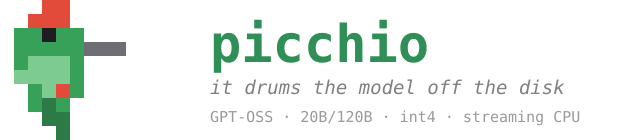

<p align="center">
  
</p>

> *The woodpecker drums a hundred times a second on a huge trunk —
> we drum 128 experts on a huge disk.*

**A streaming Mixture-of-Experts (MoE) inference engine for the GPT-OSS models
(20B and 120B), written in pure C, that runs models larger than your RAM on
ordinary consumer hardware.**

Most of a MoE model's weight is in its *experts*, and only a handful of experts
are used for each token. Picchio keeps only the small "dense" part of the model
permanently in memory and **streams the experts from disk on demand**, caching
the ones it has recently used. This is what lets a 14 GB model (20B) run
comfortably on a 16 GB laptop, and makes the 66 GB model (120B) runnable at all
without a datacenter GPU.

Inspired by [Colibri](https://github.com/JustVugg/colibri) (GLM), adapted for the
GPT-OSS architecture.

> **New to this?** Read the sections in order. Every command below is complete —
> nothing is assumed. Windows commands are shown for **PowerShell**; Linux/macOS
> equivalents are given where they differ.

---

## Table of contents

1. [What you need (hardware & software)](#1-what-you-need)
2. [Install the toolchain](#2-install-the-toolchain)
3. [Build the engine](#3-build-the-engine)
4. [Download and convert a model](#4-download-and-convert-a-model)
5. [Run it — the chat bridge (recommended)](#5-run-it--the-chat-bridge-recommended)
6. [Run it — as an OpenAI-compatible API server](#6-run-it--as-an-openai-compatible-api-server)
7. [Running the big model (120B)](#7-running-the-big-model-120b)
8. [Tuning & environment variables](#8-tuning--environment-variables)
9. [Troubleshooting](#9-troubleshooting)
10. [Verifying correctness (optional)](#10-verifying-correctness-optional)
11. [How it works & project layout](#11-how-it-works--project-layout)
12. [License](#12-license)

---

## 1. What you need

### Hardware

| Resource | Minimum | Recommended (20B) | Notes |
|---|---|---|---|
| **CPU** | x86-64 **with AVX2** | 6+ cores with AVX2/FMA | Almost every desktop/laptop CPU since ~2013 has AVX2. Without it the build fails or runs very slowly. |
| **RAM** | 8 GB | 16 GB | The 20B needs ~3 GB always resident + expert cache. More RAM = more cache = less disk reading = faster. |
| **Disk** | ~30 GB free | SSD/NVMe, ~30 GB free | The model is read from disk **constantly**, so an internal SSD matters a lot. A USB drive roughly doubles the I/O time. |

The 120B model additionally needs ~70 GB of free disk and benefits from as much
RAM as you can give it (see [section 7](#7-running-the-big-model-120b)).

### Software

- A **C compiler** (GCC or Clang). On Windows this means MSYS2/MinGW.
- **Python 3.9+** (for converting the model and for the chat/server bridges).
- An internet connection to download the model once from Hugging Face.

---

## 2. Install the toolchain

### Windows

**a) Install MSYS2 (provides the GCC compiler).**

1. Download and run the installer from <https://www.msys2.org>.
2. Accept the default install location `C:\msys64`.
3. Open the **"MSYS2 MinGW 64-bit"** terminal from the Start menu and install GCC:
   ```bash
   pacman -S mingw-w64-x86_64-gcc make
   ```
4. `build.bat` expects the compiler at `C:\msys64\mingw64\bin\gcc.exe` (the
   default). If you installed elsewhere, edit the `GCC=` line in `build.bat`.

**b) Install Python** from <https://www.python.org/downloads/> (tick
"Add Python to PATH" during setup).

### Linux

```bash
sudo apt install build-essential python3 python3-pip   # Debian/Ubuntu
```

### macOS

```bash
xcode-select --install          # gives you clang + make
brew install python             # if you don't already have Python 3
```

---

## 3. Build the engine

From the project folder (`C:\picchio` or wherever you cloned it):

### Windows

```powershell
.\build.bat
```

This produces a **self-contained `picchio.exe`** (statically linked — it does not
need any MinGW DLLs and runs from anywhere).

Or compile by hand from the MSYS2 MinGW terminal:
```bash
gcc -O2 -Wall -fopenmp -mavx2 -mfma -Wno-misleading-indentation \
    -Wno-unused-function -static -Wl,--stack,8388608 \
    -o picchio.exe picchio.c -lm -lpsapi
```

### Linux / macOS

```bash
make
```

### Why these flags (don't skip them)

- `-fopenmp` — enables multi-core. **Without it, all matmuls run on one core** and
  everything is several times slower.
- `-mavx2 -mfma` — enables the SIMD kernels. Without them the math falls back to
  slow scalar code. Your CPU must support AVX2.
- `-static` (Windows) — bakes the OpenMP/pthread runtime into the exe so you don't
  need `libgomp-1.dll` / `libwinpthread-1.dll` next to it.

### Verify the build

```powershell
.\picchio.exe --self-test        # Windows
./picchio --self-test            # Linux/macOS
```

This runs the full forward pass on a tiny synthetic model — **no model download
needed**. You should see `── self-test SUPERATO ──` ("self-test passed"). If you
do, the engine works.

---

## 4. Download and convert a model

GPT-OSS ships in a format Picchio can't read directly (MXFP4). You convert it
**once** into Picchio's INT4 format. We'll use the **20B model**, which is the
recommended choice for 16 GB machines.

### a) Install the conversion dependencies

```powershell
pip install torch safetensors numpy huggingface_hub
```

### b) Download + convert in one step

```powershell
python convert.py --model openai/gpt-oss-20b --output D:\gptoss20b_i4 --download
```

- `--model` — the Hugging Face repo id (`openai/gpt-oss-20b`).
- `--output` — a folder **you choose** where the converted model will be written.
  Put it on your fastest internal disk. Use any path you like (e.g.
  `C:\models\gptoss20b_i4` or `~/gptoss20b_i4`).
- `--download` — fetch the model from Hugging Face automatically. Omit this if you
  already downloaded the raw model yourself and pointed `--model` at a local
  folder.

This downloads several GB and writes a converted model of about **14 GB** to the
output folder. It only needs to be done once.

> **Hugging Face access:** the GPT-OSS models are openly licensed and normally
> download without an account. If you ever get a `401`/gated error, run
> `pip install huggingface_hub` and `huggingface-cli login` once with a free
> token from <https://huggingface.co/settings/tokens>.

### c) Build the tokenizer file

Picchio needs a small binary tokenizer file next to the model:

```powershell
python export_vocab.py D:\gptoss20b_i4\tokenizer.json D:\gptoss20b_i4\picchio_vocab.bin
```

(The two arguments are: the `tokenizer.json` that came with the model, and the
output path for the binary vocab. `export_vocab.py` has no dependencies.)

Your model folder is now ready to use.

---

## 5. Run it — the chat bridge (recommended)

`chat.py` is the **recommended way to talk to the model**. It uses OpenAI's
official "Harmony" library to format the conversation exactly the way GPT-OSS
expects, so the output is correct token-for-token.

### a) Install the chat dependency

```powershell
pip install -r requirements-chat.txt
```

(That installs `openai-harmony`, the only extra package needed to chat.)

### b) Ask a single question

```powershell
python chat.py "Write a short greeting in English." --model D:\gptoss20b_i4 --pin-gb 4 --ctx 1024
```

- **`--model`** — the folder you converted in step 4. **You must pass this**
  (the built-in default points at a 120B path and won't match your setup).
- **`--pin-gb`** — how many GB of RAM to spend on the expert cache. More = faster
  (fewer disk reads). `4` is a good start on a 16 GB machine.
- **`--ctx`** — context window in tokens (how much conversation history fits).
  `1024` is fine to start.

### c) Interactive multi-turn chat

Omit the prompt to get a chat loop that keeps the model and its cache in memory
between turns:

```powershell
python chat.py --model D:\gptoss20b_i4 --pin-gb 4 --ctx 1024 --max-tokens 200 --temperature 0.7
```

Type your message after `Tu:`. Type `/exit` or `/quit` to leave.

### Useful chat options

| Option | What it does |
|---|---|
| `--temperature 0.7` | Randomness. **Use ~0.7 for normal conversation.** The default `0` (greedy) is deterministic but can make the model loop in its "thinking" channel without answering. |
| `--max-tokens 200` | Maximum length of the reply. |
| `--no-reasoning` | Skip the internal "analysis" (chain-of-thought) and answer directly. Faster. |
| `--show-analysis` | Show the model's private reasoning instead of only the final answer. |
| `--top-p`, `--top-k`, `--seed` | Standard sampling controls. |
| `--reasoning low\|medium\|high` | How much the model thinks before answering. |
| `--json` | Print the structured reply as JSON. |
| `--dry-run` | Show the exact tokens that would be sent, without loading the model (handy for debugging). |

### The bare-metal path (advanced / quick test)

You can run the engine directly without Python. This uses a **built-in
approximate tokenizer** (not token-exact — prefer `chat.py` for real use):

```powershell
$env:MODEL = "D:\gptoss20b_i4"
$env:INPUT = "The capital of Italy is"
$env:MAX   = "40"
.\picchio.exe
```

On Linux/macOS:
```bash
MODEL=~/gptoss20b_i4 INPUT="The capital of Italy is" MAX=40 ./picchio
```

---

## 6. Run it — as an OpenAI-compatible API server

`server.py` exposes the model over HTTP with the same API shape as OpenAI, so any
OpenAI-compatible client or tool can talk to it. It uses only the Python standard
library plus `openai-harmony` (already installed in step 5a).

### Start the server

```powershell
python server.py --model D:\gptoss20b_i4 --port 8000 --pin-gb 4 --ctx 1024
```

It prints `[server in ascolto su http://127.0.0.1:8000 ...]` when ready.

### Endpoints

- `POST /v1/chat/completions` — streaming (SSE) and non-streaming.
- `GET  /v1/models`
- `GET  /health`

### Use it from the official OpenAI Python client

```python
from openai import OpenAI
client = OpenAI(base_url="http://127.0.0.1:8000/v1", api_key="not-needed")

resp = client.chat.completions.create(
    model="gptoss20b",
    messages=[{"role": "user", "content": "Say hello in one sentence."}],
    max_tokens=64,
    temperature=0.7,
)
print(resp.choices[0].message.content)
```

### Use it with `curl`

```bash
curl http://127.0.0.1:8000/v1/chat/completions \
  -H "Content-Type: application/json" \
  -d '{"model":"gptoss20b","messages":[{"role":"user","content":"Hello"}],"max_tokens":64}'
```

**Per-request options** (in the JSON body): `temperature`, `top_p`, `top_k`,
`max_tokens`, `reasoning_effort` (`"low"`/`"medium"`/`"high"`), and
`no_reasoning: true`.

**Note:** the model is a single process with one KV-cache, so requests are handled
**one at a time** (serialized). This is meant for personal/local use, not for
serving many users concurrently.

---

## 7. Running the big model (120B)

The 120B is ~66 GB converted. It runs on the same machine as the 20B — just more
slowly, because more must be streamed from disk.

### Download + convert shard by shard

Downloading and converting all 66 GB at once needs a lot of temporary disk.
`convert_streaming.py` does it **one shard at a time**, never keeping more than
one raw shard on disk:

```powershell
$env:PYTHONUTF8 = "1"                       # so progress symbols print correctly
$env:HF_HUB_ENABLE_HF_TRANSFER = "1"        # faster downloads (optional)
python convert_streaming.py
```

Output/paths are set at the top of `convert_streaming.py` (`OUTPUT`, `RAW_DIR`,
`REPO`); edit them if you want different locations. The process is
**resumable** — already-converted shards are skipped if you re-run it.

> **Slow download?** Hugging Face can be throttled on some connections. A regional
> mirror is often much faster — set `$env:HF_ENDPOINT = "https://hf-mirror.com"`
> before running. The conversion resumes wherever it left off.

### Expert bias sidecar

The 120B needs a small extra file of expert biases. Regenerate it (without
re-downloading the whole model) with:

```powershell
python download_expert_biases.py
```

This writes `expert_biases.safetensors`, which you pass to the engine via
`MODEL_AUX` (see below).

### Spreading the model across two disks

If the model doesn't fit on one drive, put some shards on another and list the
extra files in `MODEL_AUX` (semicolon-separated):

```powershell
$env:MODEL_AUX = "C:\picchio\expert_biases.safetensors;C:\picchio\model-00012.safetensors"
$env:OMP_NUM_THREADS = "6"
$env:PIN_GB = "1"
.\picchio.exe D:\gptoss_i4
```

`chat.py` and `server.py` auto-detect the bias sidecar and shard 12 in the current
folder; `--model-aux` overrides this explicitly.

---

## 8. Tuning & environment variables

Picchio is configured through environment variables (the `chat.py`/`server.py`
flags map onto these). The most useful:

| Variable | Default | Meaning |
|---|---|---|
| `MODEL` | — | Path to the converted model folder (or pass it as the first argument). |
| `PIN_GB` | **auto** | GB of RAM for the expert cache. **The single biggest performance knob.** By default it's sized automatically from your physical RAM (all RAM minus a ~6 GB reserve). A bigger cache means fewer disk reads. Setting a value overrides the auto-sizing. |
| `CTX` | 512 | KV-cache size in tokens (max prompt+generation length). |
| `OMP_NUM_THREADS` | all cores | Number of CPU threads for the matmuls. |
| `MAX` | 128 | Max tokens to generate (bare-metal run only). |
| `TEMPERATURE` | 1.0 | Sampling temperature (`0` = greedy). |
| `TOPP` / `TOPK` | 0.95 / 50 | Nucleus / top-k sampling. |
| `SEED` | fixed | RNG seed for reproducible sampling. |
| `IO_THREADS` | 4 | Threads used for reading experts from disk in parallel. |
| `MODEL_AUX` | — | Extra model files on other disks (semicolon-separated). |

Performance notes:

- On the 20B (6 cores, model on NVMe) expect roughly **~0.6 s per token**.
- Keep the model on an **internal SSD**. From USB the I/O time roughly doubles.
- More RAM devoted to `PIN_GB` is almost always the best speedup: going from a
  small cache to full residency on the 20B cut disk reads by ~53% in testing.

For the design rationale and measurements, see [`DESIGN.md`](DESIGN.md).

---

## 9. Troubleshooting

**`picchio.exe` exits immediately / "libgomp-1.dll not found".**
You built without `-static`. Either rebuild with `.\build.bat` (which uses
`-static`), or run from the MSYS2 MinGW terminal / add `C:\msys64\mingw64\bin` to
your PATH.

**"Illegal instruction" crash on startup.**
Your CPU lacks AVX2, or you built for a different CPU. Rebuild on the machine you
run on. AVX2 is required.

**The model keeps "thinking" and never gives an answer.**
You're in greedy mode. Add `--temperature 0.7` (chat) or set `TEMPERATURE=0.7`.

**Output is gibberish / degenerates in long replies.**
Make sure you converted with the current `convert.py` (it keeps the embedding and
output head at INT8 as required). Models converted with older code must be
reconverted.

**Out of memory / very slow.**
Lower `PIN_GB` (e.g. `--pin-gb 2`) and/or lower `--ctx`. Streaming still works with
a small cache; it just reads from disk more often.

**Conversion download is extremely slow (120B).**
See the mirror tip in [section 7](#7-running-the-big-model-120b)
(`HF_ENDPOINT=https://hf-mirror.com`).

**Garbled accented characters in terminal output (Windows).**
Set `PYTHONUTF8=1` before running Python scripts.

---

## 10. Verifying correctness (optional)

If you want to confirm the math matches a reference implementation, there's a
lightweight numeric oracle (needs only `numpy` and `safetensors`):

```powershell
pip install safetensors numpy
python make_test_model.py            # writes a tiny synthetic model to ./test_model
python test_forward.py test_model    # validates the forward pass against the oracle
```

The built-in `picchio --self-test` (section 3) is the quickest sanity check and
needs nothing at all.

---

## 11. How it works & project layout

**The idea in one paragraph:** the dense weights (attention, router, embedding,
output head) stay resident in RAM. For each token the router picks the top-4 of
128 experts per layer; Picchio loads just those experts, computing them while an
LRU cache keeps recently-used experts around and a learned hot-store keeps the
most frequently used ones pinned. Because only a few experts are touched per
token, total disk traffic is a fraction of the model size.

### Architecture (GPT-OSS)

| Property | 20B | 120B |
|---|---|---|
| Total parameters | 21 B | 117 B |
| Active per token | ~3.6 B | ~5.1 B |
| Hidden size | 2880 | 2880 |
| Layers (all MoE) | 24 | 36 |
| Experts / layer | 32 | 128 |
| Active experts / token | 4 (top-4) | 4 (top-4) |
| Attention | GQA (64 Q / 8 KV heads), sliding-window + full, attention sinks, YaRN | same |
| Converted size | ~14 GB | ~66 GB |

Quantization: experts are INT4 (group-scaled, 64), the embedding and output head
are INT8, attention is F32.

### Files in this repository

```
picchio.c              The engine (single translation unit)
quant.h                Quantized matmul kernels (F32 / INT8 / INT4) with AVX2/NEON
st.h                   safetensors reader (multi-shard, multi-disk)
json.h                 config.json parser
tok.h                  Built-in approximate tokenizer (fallback for bare-metal runs)
Makefile / build.bat   Build for Linux/macOS and Windows

convert.py             Convert a GPT-OSS model (MXFP4/BF16 -> INT4) for Picchio
convert_streaming.py   Shard-by-shard download+convert for the 120B
export_vocab.py        Build the binary tokenizer file
download_expert_biases.py  Regenerate the 120B expert-bias sidecar

chat.py                Token-exact chat bridge (Harmony), single-turn and multi-turn
server.py              OpenAI-compatible HTTP API server
requirements-chat.txt  Dependency for chat.py / server.py (openai-harmony)

make_test_model.py     Generate a tiny synthetic model for validation
test_forward.py        Numeric oracle to validate the forward pass

DESIGN.md              Design notes, rationale, and measurements
```

For a much deeper dive into the numerics, the streaming/caching design, the
service protocol, and the measured results, read [`DESIGN.md`](DESIGN.md).

---

## 12. License

Apache 2.0.
